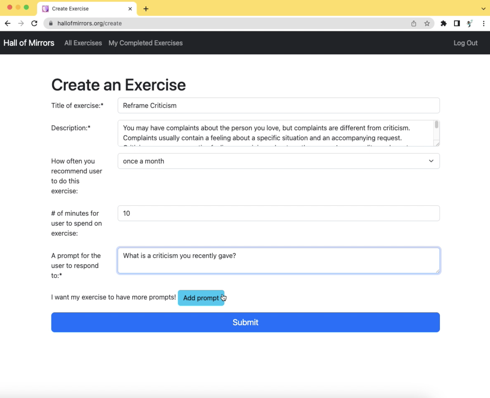
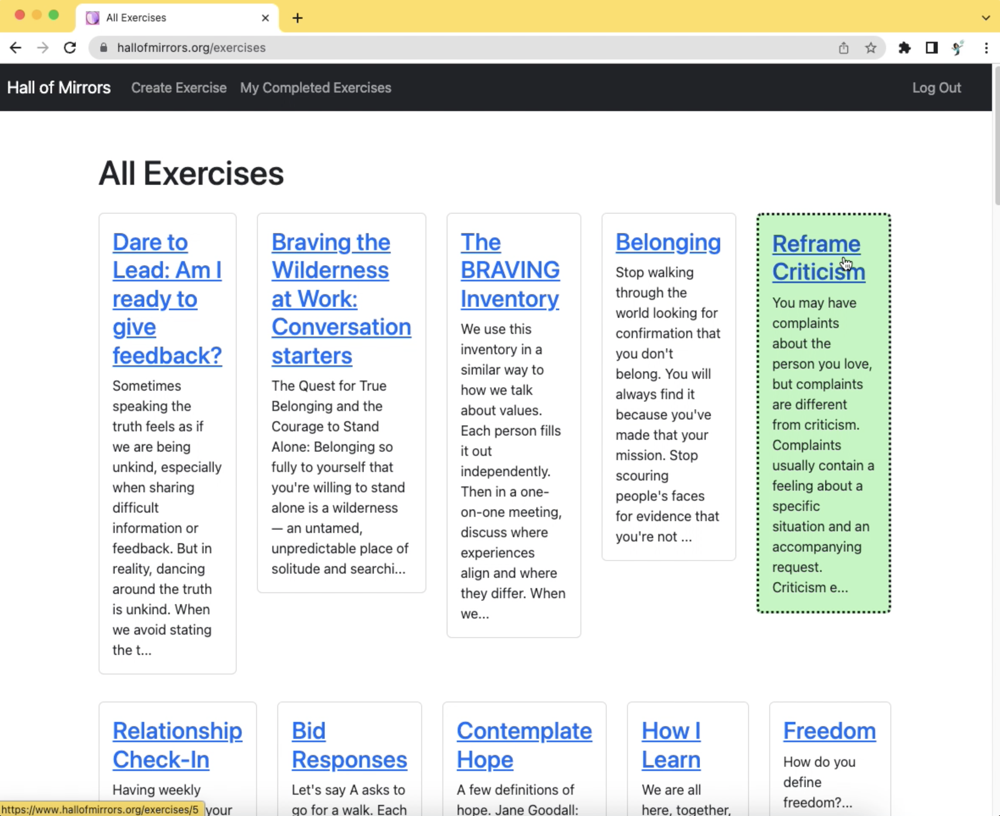
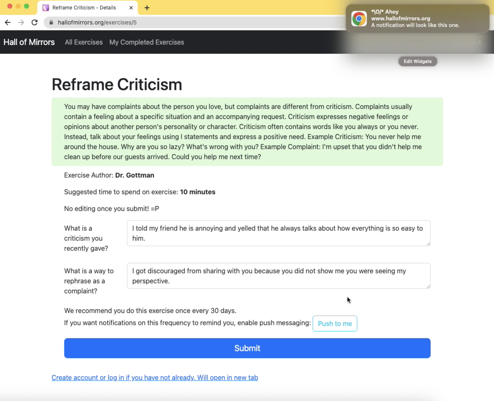
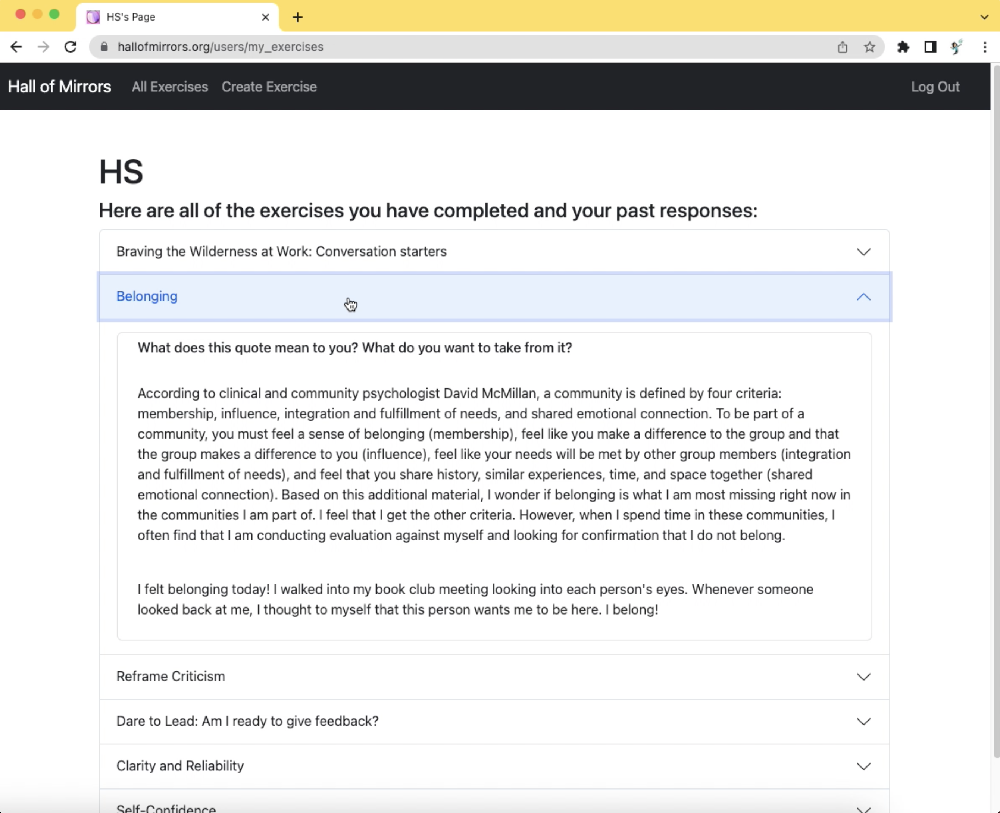

# The Hall of Mirrors
This app is deployed with AWS Lightsail at [this live link](https://hallofmirrors.org).<br>
Demo: [Video](https://youtu.be/kjDivrRaVE0)

## Description

The Hall of Mirrors is a web app for people to do journaling exercises that help them build emotional literacy, as well as for people to author exercises in service of this goal.

I have a lifelong interest in enabling relational and emotional well-being, informed by activities such as volunteering with a mental health hotline and starting a coaching practice focused on self-expression. 

## Table of Contents

- [Tech Stack](#tech-stack)
- [Data Model](#data-model)
- [Features for Users](#features-for-users)
- [Installation](#installation)
- [Tests](#tests)
- [Possible Future Features](#possible-future-features)
- [Screenshots](#screenshots)
- [Acknowledgments](#acknowledgments)
- [License](#license)

## Tech Stack

- Python
- JavaScript
- HTML
- CSS
- Flask
- SQLAlchemy
- PostgreSQL
- Jinja2
- JSON
- Push API
- Service Worker API
- Notification API
- pywebpush library for Webpush Data encryption
- Python APScheduler library

## Data Model
[Diagram](https://dbdesigner.page.link/S9QqobYsVTev3k6F6)

## Features for App Users

- Create account
- Log in
- View all exercises that can be done
- View exercises user has completed and corresponding prompts and responses
- Complete an exercise
- Create an exercise
- Get push notifications when it is time to do an exercise again

## Installation

#### Requirements:

- PostgreSQL 14.6
- Python 3.10
- VAPID public key, private key, and claim - [Set up your own](https://blog.mozilla.org/services/2016/08/23/sending-vapid-identified-webpush-notifications-via-mozillas-push-service/)

To have this app running on your local computer, please follow the below steps:

Clone or fork this repository.
```
$ git clone https://github.com/huaszu/mental-health-exercises-project.git
```

Save your VAPID public key, private key, and claim to `secrets.sh`.  Sample code:
```
export VAPID_PUBLIC_KEY="your_public_key"
export VAPID_PRIVATE_KEY="your_private_key"
export VAPID_CLAIM_EMAIL="mailto:you@example.com"
```

Create a virtual environment inside your mental-health-exercises-project directory.
```
$ virtualenv env
```

Activate the virtual environment.
```
$ source env/bin/activate
```

Source from `secrets.sh` to your environment.
```
$ source secrets.sh
```

Install dependencies.
```
$ pip3 install -r requirements.txt
```

Create database 'health'.
```
$ createdb health
```

Create your database tables and seed example data.
```
$ python3 model.py
$ python3 seed_database.py
```

Run the Flask app from the command line.
```
$ python3 server.py
```

If you want to use SQLAlchemy to query the database, run in interactive mode.
```
$ python3 -i model.py
```

**You can now navigate to `localhost:5000` to access the Hall of Mirrors.  Have fun!**

## Tests

To integration test the app, `test_server.py` contains tests that use `TestCase` from Python's `unittest` module.  The tests use Flask's `test_client` method to return a pretend web browser.

Run automated tests from the command line.
```
$ python3 test_server.py
```

or 

```
$ python3 server.py --test
```

## Possible Future Features

- Allow user to sign in with Google
- Enhance push notification content with clickable link that brings user to exercise and reminder of how many days have passed
- Give user access to individual user administrative page that shows which exercises they have notifications enabled for and lets user turn off any specific notification series
- Improve organization in user's view of past responses and offer insights to user about their writings
- Facilitate search on inventory of all exercises
- Allow prompt types other than long answer response, such as multiple choice
- Enable multiple people to collaborate on an exercise online

## Screenshots







## Acknowledgments 

My Hackbright instructors: Drue Gilbert, Jared Bitz, Jocelyn Tang, Sean Fagan
Engineers who have given code reviews: Helen Denisenko, Jan Bernhard, Jinsoo Lim, Leo Ahnn, Matt Piziak, Max M, Vlad Vengrenyuk

## License

[CC BY-NC](https://creativecommons.org/licenses/by-nc/4.0/): This license allows reusers to distribute, remix, adapt, and build upon the material in any medium or format for noncommercial purposes only, and only so long as attribution is given to the creator.
